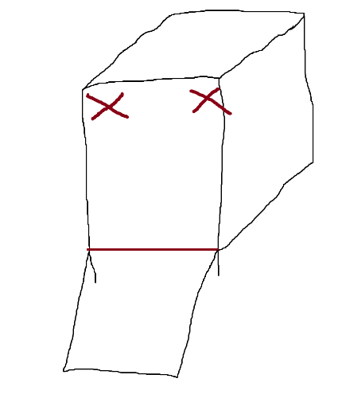

# Greenbox

Dieses Semester war unsere Challenge: „Wie können wir mit intelligenten Objekten
dazu beitragen, dass Menschen über den Klimawandel Bescheid wissen und
entsprechend handeln?“ Um herauszufinden, was unsere Mitmenschen brauchen,
oder was Ihnen noch für ein umweltbewussteres Leben fehlt, haben wir Interviews
geführt. Wir haben einiges an Input bekommen, letztendlich mussten wir uns jedoch
für eins entscheiden müssen. Die Greenbox war unser Sieger. Mit Ihr erreichen wir
einige Menschen. Die meisten von uns haben ein Auto und benutzen es – um ehrlich
zu sein – viel zu oft.
Die Greenbox hilft dem Nutzer sein Nutzverhalten bezüglich seines Autos aktiv zu
überdenken. Unsere Schlüsselbox gibt Anreize kürzere Strecken mit anderen
Verkehrsmitteln, wie zum Beispiel das Fahrrad oder zu Fuß zurückzulegen. Durch
farbige LED wird dem Nutzer ein Feedback zu seinem Fahrverhalten gegeben.

## Vorbereitung

### Material

* Arduino Mega 2560 inklusive USB-Kabel
* Touchdisplay 2,8" TFT LCD Shield
* 2x Pappelsperrholzplatte 300x420x4 mm
* Knopfmagnet
* Steuerbarer Elektromagnet
* 2x Holzstab 80mm & 4mmØ
* 4x4 Tastenfeld

### Werkzeug
* Lasercutter
* Heißklebepistole
* Lötstation
* Feile

### Empfohlene Vorkenntisse
* Grundlagen C/C++
* Handwerkliche Grundkenntnisse

## Bauanleitung

### Zuschneiden der Box

Wir haben unsere Schnittpläne mit Inkscape erstellt, aber falls du Änderungen vornehmen willst, funktioniert jeder Vektorgrafikeditor.
Um möglichst wenig Sperrholz zu verbrauchen, haben wir die einzelnen Elemente
versucht möglichst platzsparend auf der Schnittplatte zu verteilen.

[Hier]() und [hier]() kannst du dir die Schnittpläne runterladen. Solltest du nicht wissen wie damit umzugehen ist, frage am besten
in deinem lokalen Makerspace nach und dir wird bestimmt weitergeholfen.

### Zusammensetzen der Box

Damit wir keinen Holzleim brauchen, haben wir uns für ein Zackenmuster entschieden.
Dadurch kann man die einzelnen Holzplatten ineinanderstecken und man hat eine
stabile Box.

Bevor man die einzelnen Elemente ineinanderstecken kann, muss man davor noch den
kleinen Holzstab zurechtschneiden. Hier empfiehlt sich dieselbe Länge wie die
Bodenplatte, sprich 8 cm.

Danach steckt man zunächst in die Bodenplatte die Seitenwände und die zwei
Holzstäbe durch die Löcher. Der hintere Stab wird verklebt, um eine maximale Öffnung
der späteren Klappe sicherzustellen.

An dem vorderen Stab wir die Klappe mit Heißkleber befestigt. Jetzt lässt sich die Box
öffnen und schließen.

Jetzt ist es an der Zeit die Trennwand zwischen der Elektronik und der Schlüsselkammer
einzkleben. Diese wird so angebracht das sie den Schlitz an der Vorderseite nicht blockiert.

**Achtung:** Rückwand und Deckel werden erst mal nicht befestigt, damit es nicht zu kompliziert wird die Elektronik einzubauen.

### Den Elektromagneten befestigen

Um die Klappe öffnen und schließen zu können, benötigen wir einen
Schließmechanismus. Wir haben uns für einen Elektromagneten entschieden. Sobald
die Klappe geöffnet werden soll, stößt er den anderen Magneten ab. In den anderen
Fällen ist die Klappe geschlossen und nicht einfach so zu öffnen.
In dem Bild sind die möglichen Platzierungsmöglichkeiten für den Elektromagneten
aufgezeigt. Bitte denke daran, dass auf derselben Seite auch der kleinere Magnet auf
der Klappe befestigt werden muss.

Den Elektro- wie den Knopfmagneten kann man einfach mit Heißkleber befestigen.
Dabei sollte auf einen kleinen Abstand geachtet werden um bei Bedarf Puffermaterial einzusetzen.
Das kann nötig sein, da der Elektromagnet nicht alzu stark ist und ansonsten leicht von dem
Knopfmagneten überlastet werden kann.

### Das Tastenfeld anbringen

Das flache Kabel des Tastenfelds wird durch den schmalen Schlitz im Gehäuse gesteckt.
Es kann auf beliebige Arten verklebt werden, wir haben uns für doppelseitiges Klebeband entschieden.

### Verkabelung

Jetzt können schon alle Teile miteinander verkabelt werden.
Anstelle eines Breadboards können die Kabel auch einfach miteinander verlötet werden.

Eine detalierte Version kann [hier](assets/images/schaltplan.pdf) geladen werden.

Das Display kann nun in die dafür vorgesehene Öffnung an der Frontseite des Gehäuses gesteckt werden.
Sollte das Display zu locker sitzen, kann mit etwas Heißkleber nachgeholfen werden.