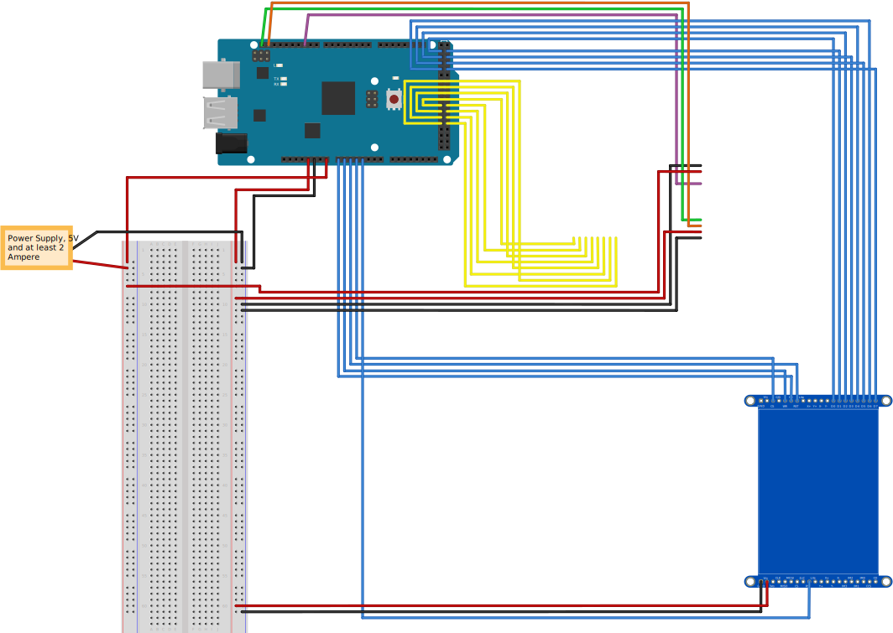

# Greenbox

Dieses Semester war unsere Challenge: „Wie können wir mit intelligenten Objekten
dazu beitragen, dass Menschen über den Klimawandel Bescheid wissen und
entsprechend handeln?“ Um herauszufinden, was unsere Mitmenschen brauchen,
oder was Ihnen noch für ein umweltbewussteres Leben fehlt, haben wir Interviews
geführt. Wir haben einiges an Input bekommen, letztendlich mussten wir uns jedoch
für eins entscheiden müssen. Die Greenbox war unser Sieger. Mit Ihr erreichen wir
einige Menschen. Die meisten von uns haben ein Auto und benutzen es – um ehrlich
zu sein – viel zu oft.
Die Greenbox hilft dem Nutzer sein Nutzverhalten bezüglich seines Autos aktiv zu
überdenken. Unsere Schlüsselbox gibt Anreize kürzere Strecken mit anderen
Verkehrsmitteln, wie zum Beispiel das Fahrrad oder zu Fuß zurückzulegen. Durch
farbige LED wird dem Nutzer ein Feedback zu seinem Fahrverhalten gegeben.

## Vorbereitung

### Material

* Arduino Mega 2560 inklusive USB-Kabel
* Touchdisplay 2,8" TFT LCD Shield
* 2x Pappelsperrholzplatte 300x420x4 mm
* Knopfmagnet
* Steuerbarer Elektromagnet
* 2x Holzstab 80mm & 4mmØ
* 4x4 Tastenfeld

### Werkzeug
* Lasercutter
* Heißklebepistole
* Lötstation
* Feile

### Empfohlene Vorkenntisse
* Grundlagen C/C++
* Handwerkliche Grundkenntnisse

## Bauanleitung

### Zuschneiden der Box

### Verkabelung

