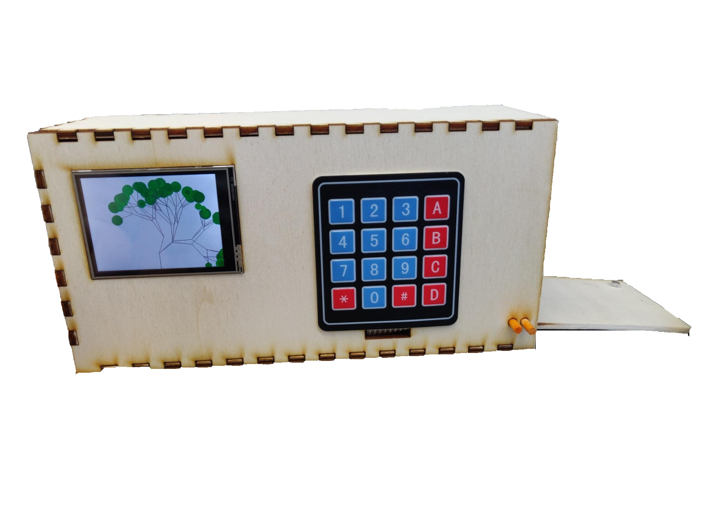
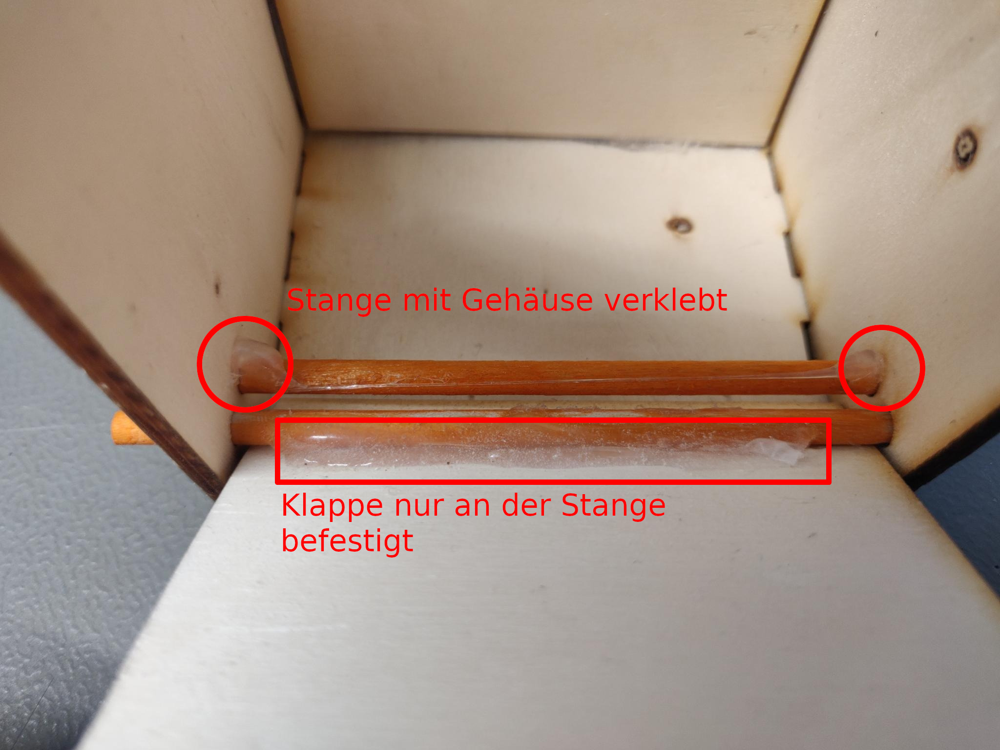
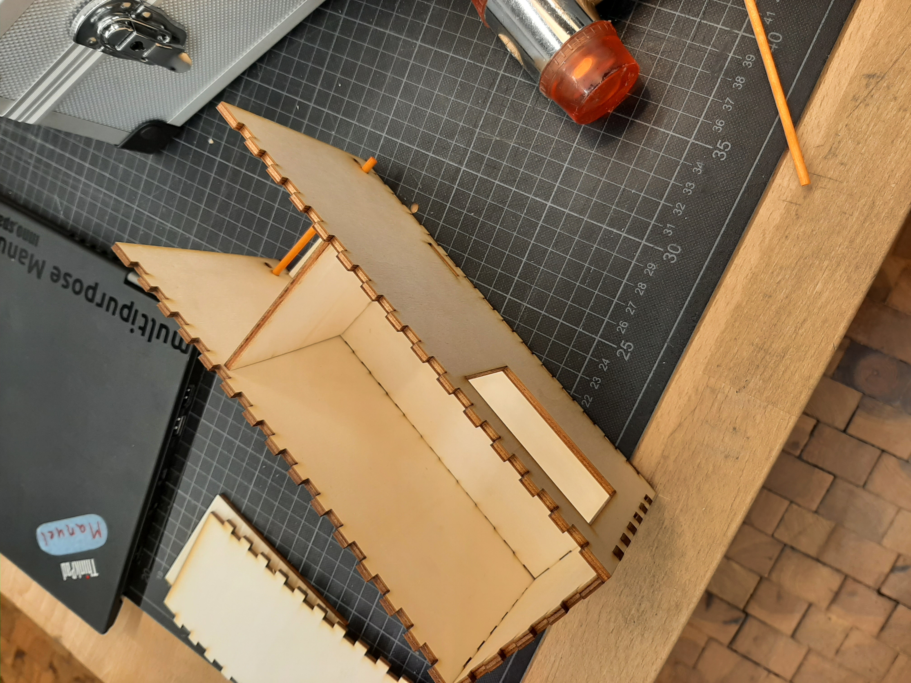
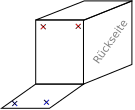
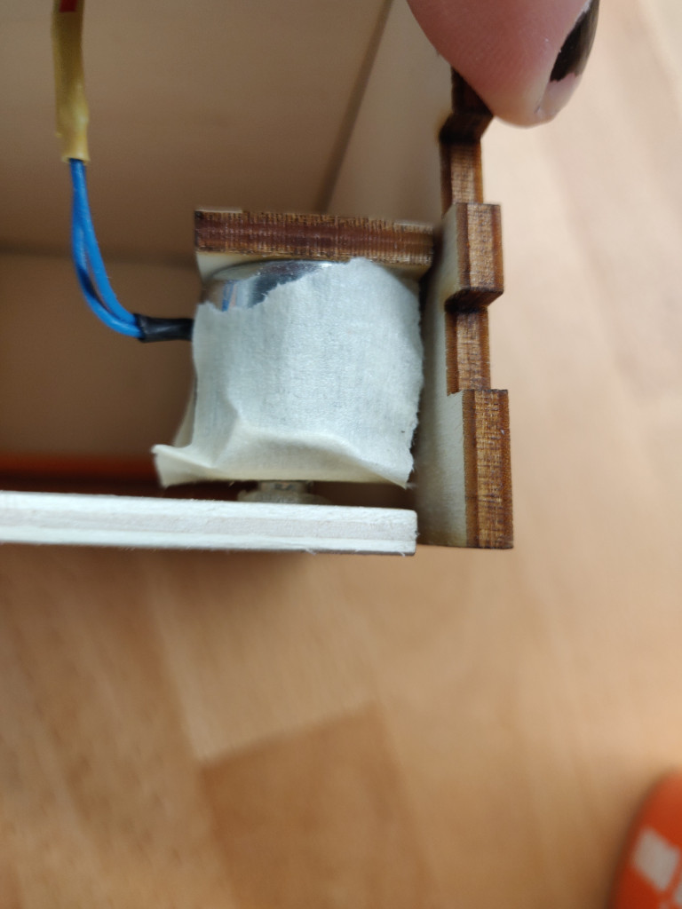
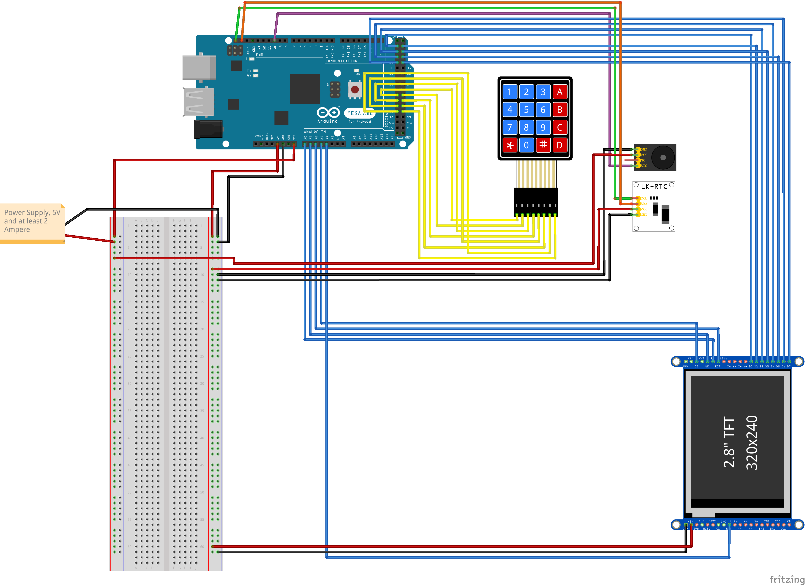
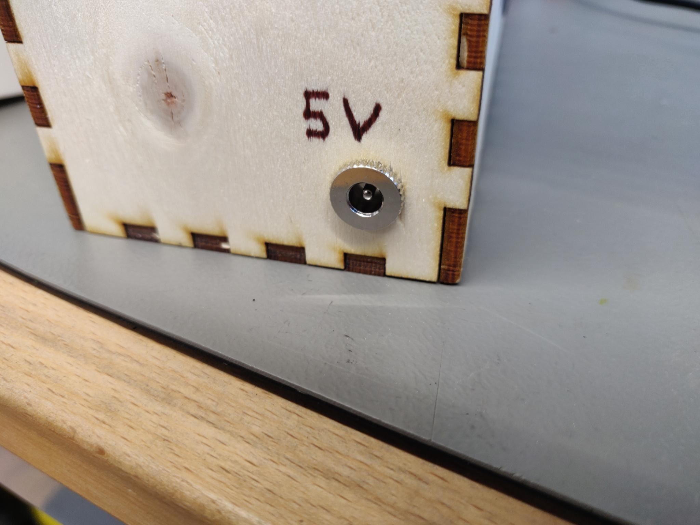
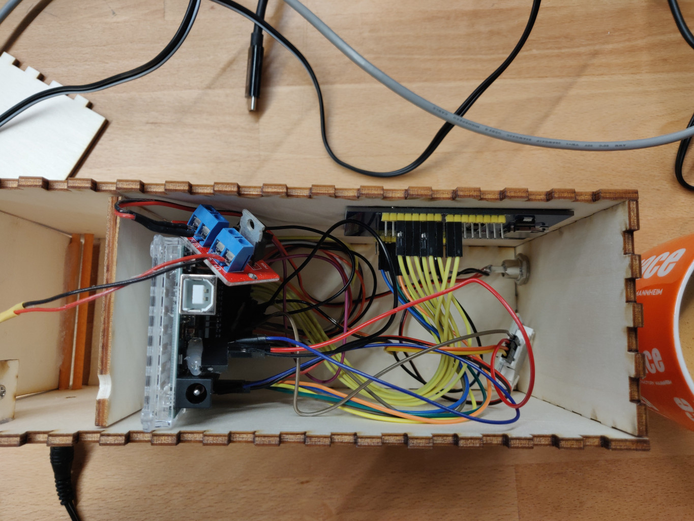

# Greenbox

## Inhaltsverzeichnis

* [Vorbereitung](#vorbereitung)
  + [Material](#material)
  + [Werkzeug](#werkzeug)
  + [Software](#software)
  + [Empfohlene Vorkenntisse](#empfohlene-vorkenntisse)
* [Bauanleitung](#bauanleitung)
  + [Zuschneiden der Box](#zuschneiden-der-box)
  + [Zusammensetzen der Box](#zusammensetzen-der-box)
  + [Den Elektromagneten befestigen](#den-elektromagneten-befestigen)
  + [Das Tastenfeld anbringen](#das-tastenfeld-anbringen)
  + [Verkabelung](#verkabelung)
  + [Den Arduino programmieren](#den-arduino-programmieren)
  + [Alles zusammenbringen](#alles-zusammenbringen)
* [Funktionsweise](#funktionsweise)
* [Ausblick](#ausblick)

Dieses Semester war unsere Challenge: „Wie können wir mit intelligenten Objekten dazu beitragen, dass Menschen über den Klimawandel Bescheid wissen und entsprechend handeln?“ 

Um herauszufinden, was unsere Mitmenschen brauchen, oder was Ihnen noch für ein umweltbewussteres Leben fehlt, haben wir Interviews geführt. Wir haben einiges an Input bekommen, letztendlich mussten wir uns jedoch für eins entscheiden müssen. Die Greenbox war unser Sieger. Mit Ihr erreichen wir einige Menschen. Die meisten von uns haben ein Auto und benutzen es – um ehrlich
zu sein – viel zu oft. 

Die Greenbox hilft dem Nutzer sein Nutzverhalten bezüglich seines Autos aktiv zu überdenken. Unsere Schlüsselbox gibt Anreize kürzere Strecken mit anderen Verkehrsmitteln, wie zum Beispiel das Fahrrad oder zu Fuß zurückzulegen. 
Durch farbige LED wird dem Nutzer ein Feedback zu seinem Fahrverhalten gegeben.

## Vorbereitung

### Material

- Arduino Mega 2560 inklusive USB-Kabel
- Touchdisplay 2,8" TFT LCD Shield
- 2x Pappelsperrholzplatte 300x420x4 mm
- Knopfmagnet
- Steuerbarer Elektromagnet
- 2x Holzstab 80mm & 4mmØ
- 4x4 Tastenfeld
- DS1307 Realtime Clock mit I2C Schnittstelle
- Knopfbatterie für die Realtime Clock

### Werkzeug

- Lasercutter
- Heißklebepistole
- Lötstation
- Feile

### Software
- Inkscape
- Optional: [Boxes.py](https://www.festi.info/boxes.py/) (Webseite zur generierung von Schnittplänen)
- Arduino IDE

### Empfohlene Vorkenntisse

- Grundlagen C/C++
- Handwerkliche Grundkenntnisse

Für den Bau unseres Projekts haben wir uns für einen Arduino Mega 2560 entschieden. Dieser verfügt über genügend Ports und Speicher, um alle elektronischen Komponenten zu steuern. Ein Touchdisplay wird für die visuelle Interaktion verwendet, jedoch erfolgen Benutzereingaben ausschließlich über ein externes Tastenfeld. Ein Realtime-Clock-Modul sorgt dafür, dass sich der Arduino das Datum und die Uhrzeit merken kann. Ein Elektromagnet steuert den Türmechanismus.

## Bauanleitung

### Zuschneiden der Box

Als erstes brauchen wir die Box selbst, bevor wir uns um die Elektronik kümmern können. Hierfür eignet sich eine simple Box aus Sperrholz, die wir mit einem Lasercutter zuschneiden.
Den groben Aufbau der Box und den richtigen Maßen habeb wir mit der Webseite [Boxes.py](https://www.festi.info/boxes.py/) erstellt, den wir dann mit Inkscape bearbeitet um die entsprechenden Löcher und Schlitze ergänzt haben. Falls du jedoch Änderungen vornehmen willst, funktioniert jeder Vektorgrafikeditor.
Um möglichst wenig Sperrholz zu verbrauchen, haben wir versucht, die einzelnen Elemente möglichst platzsparend auf der Schnittplatte zu verteilen.

[Hier](./assets/lasercutter/box_schnittplan.svg) kannst du dir die Schnittpläne runterladen. Solltest du nicht wissen wie damit umzugehen ist, frage am besten in deinem lokalen Makerspace nach und dir wird bestimmt weitergeholfen.

### Zusammensetzen der Box

Nachdem die Holzteile ausgeschnitten wurden, kann man die Box nun größtenteils zusammensetzen. Damit wir keinen Holzleim brauchen, haben wir uns für ein Zackenmuster entschieden. Der Vorteil ist, dass man die einzelnen Holzplatten nur ineineinander zu stecken braucht und dann eine stabile Box hat.

Bevor man die einzelnen Elemente ineinanderstecken kann, muss man davor noch den kleinen Holzstab zurechtschneiden. Hier empfiehlt sich dieselbe Länge wie die Bodenplatte, sprich 8 cm.

Danach steckt man zunächst in die Bodenplatte die Seitenwände und die zwei Holzstäbe durch die Löcher. Der hintere Stab wird mit dem Gehäuse verklebt. Er verhindert, dass die Klappe später zu weit aufgeht. Wie das ungefähr aussehen soll, sieht man in den folgenden Bildern:

An dem vorderen Stab wir die Klappe mit Heißkleber befestigt. Jetzt lässt sich die Box öffnen und schließen.

<video width="420" height="340" controls>
  <source src="./assets/videos/Klappe.mp4" type="video/mp4">
</video>

Jetzt ist es an der Zeit, die Trennwand zwischen der Elektronik und der Schlüsselkammer einzukleben. Diese wird so angebracht, dass sie den Schlitz für das Keypadkabel an der Vorderseite nicht blockiert.

**Achtung:** Rückwand und Deckel werden erst mal nicht befestigt, damit es nicht zu kompliziert wird, die Elektronik einzubauen.

### Den Elektromagneten befestigen

Um die Klappe öffnen und schließen zu können, benötigen wir einen Schließmechanismus. Wir haben uns für einen Elektromagneten entschieden. Sobald die Klappe geöffnet werden soll, stößt er den anderen Magneten ab. Ansonsten  ist die Klappe geschlossen und nicht ohne weiteres zu öffnen.
In dem Bild sind die möglichen Platzierungsmöglichkeiten für den Elektromagneten aufgezeigt. Bitte denke daran, dass auf derselben Seite auch der kleinere Magnet auf
der Klappe befestigt werden muss.

Den Elektro- wie den Knopfmagneten kann man einfach mit Heißkleber befestigen. Dabei sollte auf einen kleinen Abstand geachtet werden, um bei Bedarf Puffermaterial einzusetzen. Das kann nötig sein, da der Elektromagnet nicht allzu stark ist und ansonsten leicht von dem
Knopfmagneten überlastet werden kann.

Es gibt zwei Stellen, an denen der Magnet befestigt werden kann, in der Grafik mit einem roten X makiert. Entsprechend muss unten auf derselben Seite an der Klappe der Knopfmagnet befestigt werden (blaues Kreuz).

So sieht der Magnet in unserem Beispiel aus: 

### Das Tastenfeld anbringen

Nun können wir das Tastenfeld an das Gehäuse anbringen.
Hierzu wird das flache Kabel des Tastenfelds durch den schmalen Schlitz am Gehäuse gesteckt.
Es kann auf beliebige Arten verklebt werden, wir haben uns für doppelseitiges Klebeband entschieden. Wie das Tastenfeld dann am Gehäuse aussieht, sieht man in der folgenden Grafik:

### Verkabelung

Jetzt können schon alle elektronischen Teile miteinander verkabelt werden. Wir benutzen hier ein Breadboard, aber
anstelle dessen können die Kabel auch einfach miteinander verlötet werden. Hier ist eine grobe Übersicht, wie die einzelnen Teile mit welchen Ports am Arduino verbunden werden müssen. 

Eine detalierte Version von diesem Schaltplan kann [hier](assets/images/schaltplan.pdf) heruntergeladen werden.

### Den Arduino programmieren

Um den Arduino zu programmieren, ist es am praktischsten, die Arduino IDE zu benutzen. Dafür öffnet man unter `File >> open...` die `firmware.ino` in dem `firmware` Ordner in diesem Repository.

Die Unterstützung für den Arduino Mega, den wir verwenden, muss eventuell nachinstalliert werden. Dafür geht man in den Board Manager (`Tools >> Board >> Boards Manager...`) und installiert die `Arduino AVR Boards`.

Damit das Projekt funktionieren kann, müssen folgende Libraries über den Library Manager (`Tools >> Manage Libraries...`) installiert werden:

- TimeLib (als Time gelistet)
- DS1307RTC
- Adafruit TFTLCD
- Adafruit Keypad

Nun kann das Programm kompiliert und auf den Arduino geladen werden. Hierzu muss man lediglich auf den Upload-Button drücken, der wie ein rechter Pfeil aussieht. Alternativ kann man auch einfach `STRG + U` drücken. 

### Alles zusammenbringen

Spätestens jetzt wäre ein guter Zeitpunkt, um alle Komponenten und die Software auf Funktionalität zu testen, bevor alles zusammengesetzt wird.
In unserem Fall haben wir die Elektronik vor dem Einsetzen in die Box getestet.

<!--Hier kann man unseren Test der Komponenten sehen:

<video width="420" height="340" controls>
  <source src="./assets/videos/Klappe.mp4" type="video/mp4">
</video>-->

Das Display kann nun in die dafür vorgesehene Öffnung an der Frontseite des Gehäuses gesteckt werden.
Sollte das Display zu locker sitzen, kann mit etwas Heißkleber nachgeholfen werden. Genauso kann mit einer Feile nachgeholfen werden, sollte die Öffnung etwas zu eng ausfallen.

In der linken Seitenplatte ist ein Loch gelassen worden, das für die Stromzufuhr genutzt werden kann. Wer es besonders schön haben will, kann an dieser Stelle einen Barrelplug einbauen. Je nach Variante müsste dafür noch das Schnittmuster für den Lasercutter angepasst werden.

Hier sieht man die Verkabelung von oben:

Ist diese alles geschehen, können nun die restlichen Wände und die Decke der Box befestigt werden. 
Am Ende haben wir eine kleine schicke Box:

## Funktionsweise

Die Greenbox kann nun eingeschaltet werden, indem einfach nur das Netzteil in die Öffnung gesteckt wird. Der Bildschirm sollte aufleuchten und den Nutzer mit einem Baum- Screensaver begrüßen.
Wird eine Taste gedrückt, wird auch schon die erste Frage angezeigt.

In der Leiste unten im Display werden 29-31 Zellen angezeigt, die den Verbrauch im aktuellen Monat bewertet. Je roter die Farbe, umso mehr hat der Nutzer sein Auto an diesem Tag benutzt.

Zusätzlich verändert der Baum, der in inaktiven Zeiten angezeigt wird, seine Farbe und Größe desto öfter der Schlüssel entnommen wird. Da immer nur die bisherigen Tage eines Monats berücksichtigt werden, ist es möglich den Baum wieder zum positiven zu beeinflussen, wenn man auf das Auto verzichtet.

Die möglichen Eingaben auf dem Tastenfeld werden jederzeit angezeigt.
Bevor das Schlüsselfach geöffnet wird, werden dem Benutzer ein paar Fragen gestellt.
Nachdem der Schlüssel entnommen wurde, muss das Fach wieder geschlossen werden. Dazu reicht es, die Tür wieder so weit hoch zu schieben, dass sie magnetisch angezogen wird.

## Ausblick

Erweitern könnte man die Greenbox mit invidivuellen Verbrauchszielen, mit denen der Nutzer tracken kann,
ob er sein aktuelles Verbrauchsziel erreicht.
Auch kann man diese Daten künftig über das Wlan in ein übergreifenderes System übertragen.

Außerdem könnten dem Nutzer verschiedene Fragen gestellt werden, die zu beantworten sind bevor der Countdown startet. Dies gewährleistet, dass man immer aktiv lesen muss und das Öffnen der Box nicht zur Gewohnheit wird.

Eine andere Erweiterungsmöglichkeit wäre, äußere Gegebenheiten wie die Jahreszeit mit einzubeziehen und beispielsweise im Winter eine Fahrt mehr zu erlauben bevor der Tag rot markiert wird.
Eine Notfalloption, mit der man den Schlüssel ohne 10 Sekunden Wartezeit erhält, sollte auch noch hinzugefügt werden.
